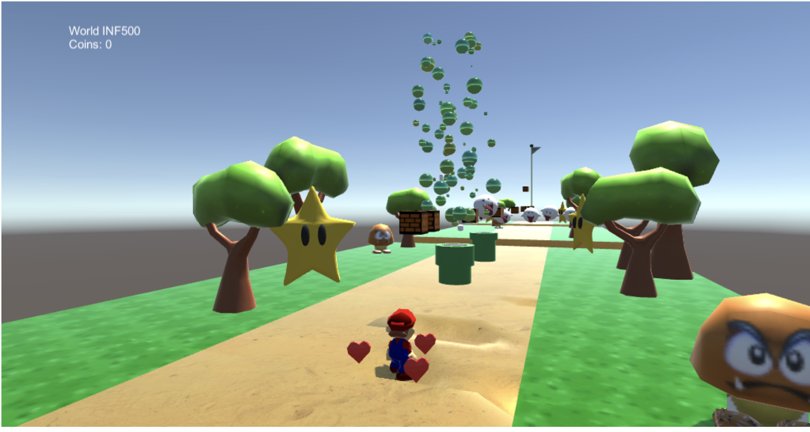

# Mario-Unity

This project, done in collaboration with Roxane Fischer, was a self initiated project for the INF585-Computer Animation at Ecole Polytechnique.
The goal of this project was to recreate a 3D Mario inspired game that included meshes deformations for a more realistic feel. 
It was coded in C-sharp using Unity as the game engine. 

<!-- .element height="50%" width="50%" -->

